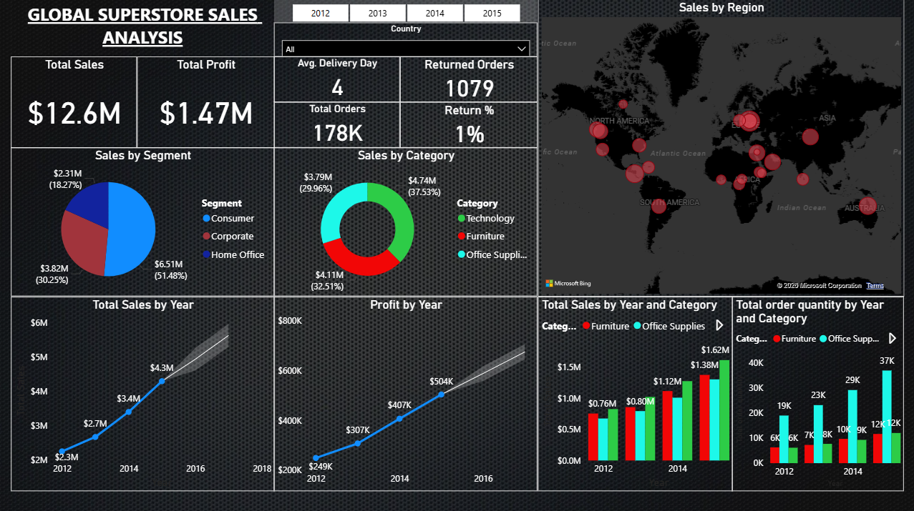
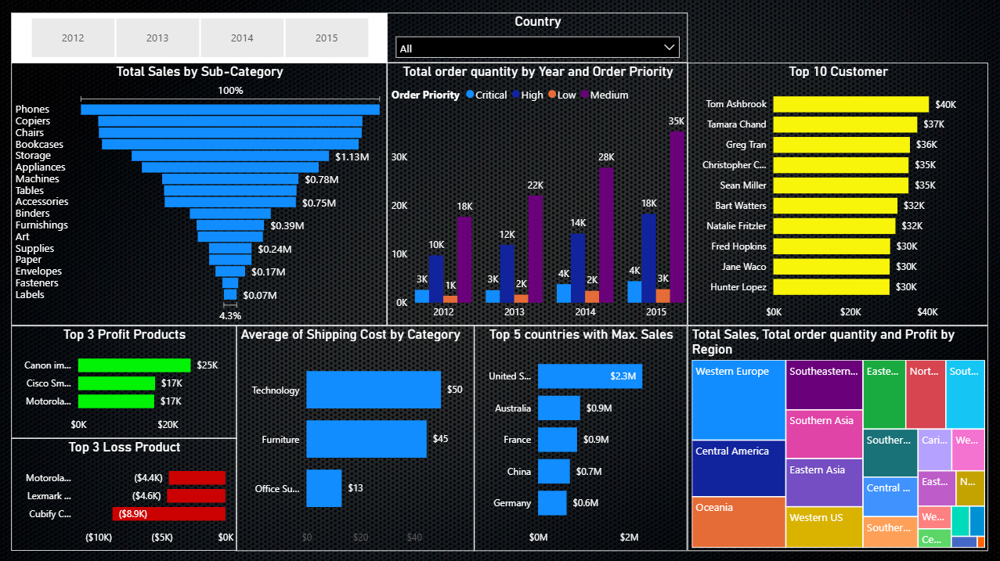

# Global Superstore Sales Analytics Dashboard

## Project Overview

Developed an interactive Power BI dashboard to analyze global retail sales performance using the Global Superstore dataset.

The project focuses on understanding sales growth, profitability, customer behavior, product performance, order trends, and regional business performance.

The dashboard converts raw Excel transactional data into meaningful business insights for decision-making.

---

# Tools Used

- Microsoft Excel
- Power BI
- Power Query
- DAX
- Data Visualization

---

# Dataset

Source file:

Global Superstore 2016 Excel Dataset

The workbook contains:

## Orders Table

Contains transaction details:

- Order ID
- Order Date
- Ship Date
- Customer Details
- Segment
- Country / Region
- Product Category
- Sales
- Profit
- Quantity
- Discount
- Shipping Cost
- Order Priority

## Returns Table

Contains:

- Returned Orders

## People Table

Contains:

- Regional manager information

---

# Data Preparation

Performed data cleaning and transformation using Power Query:

- Imported Excel workbook into Power BI
- Checked column data types
- Removed unnecessary fields
- Created calculated columns
- Prepared data for dashboard analysis

---

# Dashboard Pages

## 1. Sales Overview Dashboard

KPIs Created:

- Total Sales
- Total Profit
- Average Delivery Days
- Total Orders
- Returned Orders
- Return Percentage

Analysis:

- Sales by Region (Map Analysis)
- Sales by Customer Segment
- Sales by Product Category
- Yearly Sales Trend
- Yearly Profit Trend
- Category-wise Sales Growth
- Category-wise Quantity Trend

---

## 2. Sales Performance Analysis

Analysis Included:

### Product Analysis

- Total Sales by Sub-Category
- Top Profit Products
- Top Loss Products

### Customer Analysis

- Top 10 Customers by Sales

### Geographic Analysis

- Top Performing Countries
- Regional Sales Contribution

### Shipping Analysis

- Average Shipping Cost by Category

### Order Analysis

- Order Quantity by Year
- Order Priority Analysis

---

# Dashboard Preview

## Sales Overview

## Detailed Analysis

---

# Key Insights

- Generated analysis on $12.6M total sales
- Tracked $1.47M overall profit
- Analyzed 178K+ orders globally
- Identified top-performing countries and regions
- Compared sales performance across Consumer, Corporate and Home Office segments
- Identified profitable and loss-making products
- Monitored product category performance

---

# Skills Demonstrated

- Power BI Dashboard Development
- Power Query Data Transformation
- DAX Measures
- KPI Creation
- Data Modelling
- Sales Analytics
- Customer Analytics
- Business Intelligence Reporting

---

# Project Workflow

Excel Dataset
      |
      ↓
Power Query Cleaning
      |
      ↓
Data Modelling
      |
      ↓
DAX Calculations
      |
      ↓
Interactive Power BI Dashboard

---

## Author

Rahul
